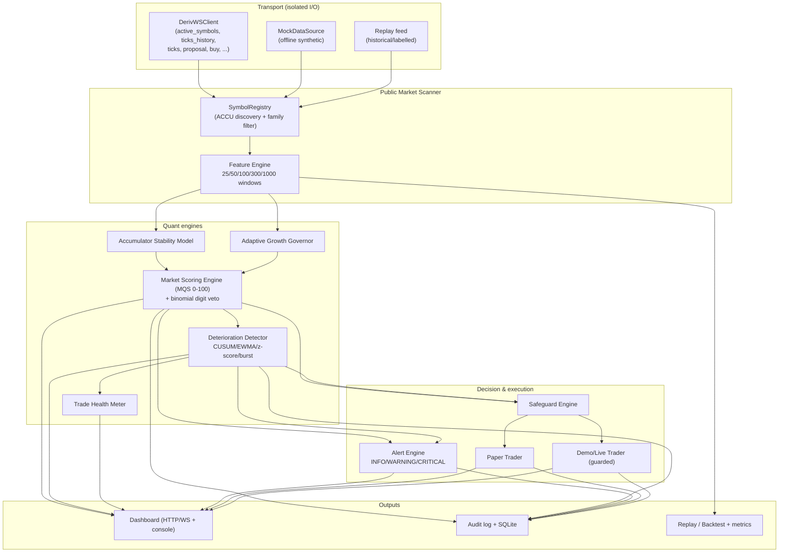
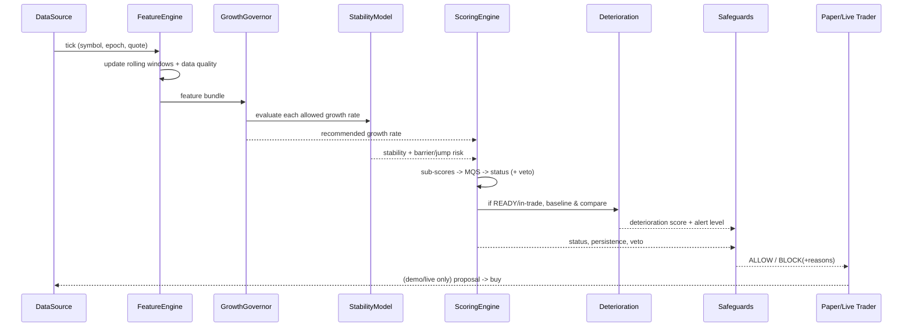
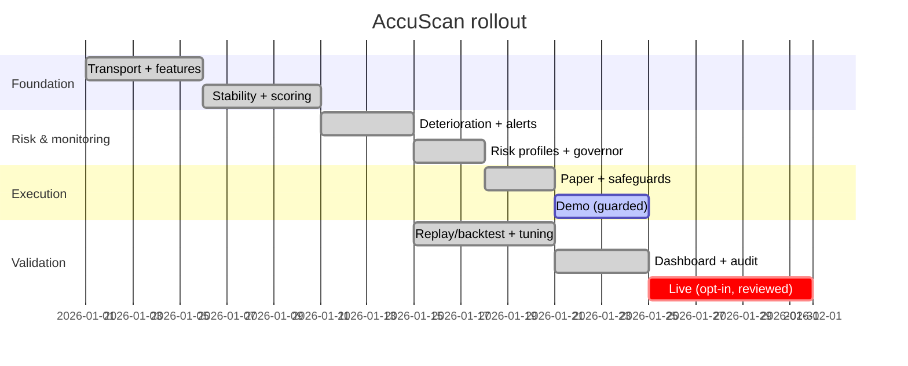

# AccuScan — Deriv Accumulator Market Intelligence

> **Research / risk-monitoring system. Not a profit guarantee, not financial advice, not a "loophole".**
> AccuScan identifies which Deriv synthetic-volatility market currently looks *least bad* for
> Accumulator Options, explains *why*, monitors deterioration *after* entry, and enforces strict
> capital-protection rules. Trading carries a real risk of losing your entire stake. See
> [docs/DISCLAIMER.md](docs/DISCLAIMER.md).

---

## 1. Executive summary

AccuScan continuously scans Deriv volatility indices, ranks them with a transparent **Market
Quality Score (MQS, 0–100)** built mainly from **market stability, jump risk, movement risk and
data quality** — with **digit-risk used only as a configurable statistical veto**, never as the
sole signal. It maintains rolling **25 / 50 / 100 / 300 / 1000**-tick windows, freezes an
**entry baseline** when a market becomes READY, and runs an online **deterioration detector**
(CUSUM + EWMA + rolling z-score + burst detection) to alert the moment conditions turn dangerous.

Execution is **off by default**. Modes escalate explicitly: `analytics → paper → demo → live`.
Every entry must clear an AND-ed **safeguard gate** (readiness persistence, data health, no active
critical alert, max daily loss, trade-rate caps, loss cooldown, growth-rate cap, explicit live
confirmation). There is **no martingale and no post-loss stake increase anywhere in the code.**

Because the Accumulator knockout is evaluated **per tick relative to the previous spot** (the band
is recalculated each tick and is *narrower at higher growth rates*), the model is built around the
**upper tail of per-tick moves**, not cumulative range — see [docs/SCORING.md](docs/SCORING.md).

### Verified behaviour (offline replay, synthetic calm→danger→calm scenario)

| Metric | conservative | moderate | aggressive |
|---|---|---|---|
| Avg MQS in calm vs danger | 80.2 vs 60.1 | 79.8 vs 66.9 | 79.2 vs 66.7 |
| Steady-state false-positive rate | 0.036 | 0.039 | 0.039 |
| False-negative rate (danger missed) | ~0.10 | ~0.10 | ~0.10 |
| Deterioration alert lead | ~2 ticks | ~2 ticks | ~2 ticks |
| Danger onsets detected | 2/2 | 2/2 | 2/2 |
| Paper max drawdown | low | low | **highest** (5% growth) |

The aggressive profile (5% growth cap) reliably shows **larger drawdowns** than conservative on the
same data — exactly the risk trade-off the system is meant to surface. The point of AccuScan is
*risk avoidance and explainability*, not guaranteed profit.

---

## 2. Product / API assumptions (Deriv, docs-first)

Anchored to Deriv official documentation; where new vs legacy docs differ the transport layer
normalises it.

- Accumulators use `contract_type: "ACCU"`.
  ([legacy-docs.deriv.com/docs/accumulator-options](https://legacy-docs.deriv.com/docs/accumulator-options))
- Growth rate ∈ {0.01, 0.02, 0.03, 0.04, 0.05} (1%–5%); **higher growth ⇒ narrower per-tick range**.
  ([deriv.com/trade/options/accumulator-options](https://deriv.com/trade/options/accumulator-options))
- The barrier range is **recalculated each tick from the current spot**; payout compounds while the
  spot stays in range. ([blog.deriv.com](https://blog.deriv.com/blog/introducing-accumulators-options-on-deriv-bot))
- Accumulators support **take-profit** via `limit_order` (no stop-loss). Two compatible paths are
  implemented: proposal-time `limit_order.take_profit` and post-buy `contract_update`.
- Endpoints used: `active_symbols`, `contracts_for`, `ticks_history`, `ticks` (subscribe),
  `proposal`, `buy`, `sell`, `proposal_open_contract`, `contract_update`, `ping`, `authorize`.
  ([developers.deriv.com](https://developers.deriv.com/docs/intro/api-overview/))

> *Deriv content above is paraphrased/summarised for licensing compliance; verify against the live
> docs before trading.* ACCU availability is **discovered dynamically** via `contracts_for`, never
> hardcoded. The exact live barrier comes from the `proposal`; the paper/replay band is a documented
> proxy (see `execution/paper_trader.py`).

---

## 3. Architecture



### Data flow (per tick)



### Implementation timeline (suggested)



---

## 4. Module map

| Module | Responsibility |
|---|---|
| `transport/` | `DerivWSClient` (real API), `MockDataSource` (offline), abstract `MarketDataSource`/`ExecutionGateway` (read vs trade are separated for safety) |
| `features/` | Rolling windows; digit features (cluster/burst/drought/entropy); movement features (tail ratio, jump proxy, adverse move, chop) |
| `stability/` | Accumulator Stability Model (per-tick tail risk, barrier risk vs growth, calmness) |
| `scoring/` | Market Quality Score (weighted) + **binomial-z digit veto** |
| `risk/` | Risk profiles + **adaptive growth governor** |
| `deterioration/` | CUSUM / EWMA / rolling z-score / burst → deterioration score, health label, alert level |
| `health/` | Trade Health Meter (baseline-relative) |
| `alerts/` | Throttled INFO/WARNING/CRITICAL alerts |
| `execution/` | Modes, safeguards, paper trader, guarded demo/live trader (dual-path take-profit) |
| `scanner/` | Symbol registry + per-tick orchestrator (`process_tick`, `snapshot`) |
| `backtest/` | Synthetic labelled scenarios + replay engine + metrics |
| `dashboard/` | Stdlib HTTP dashboard (default) + optional FastAPI/WS + static UI |
| `console/` | Live terminal dashboard (rich-optional) |
| `audit/`, `storage/` | Structured JSONL audit + SQLite persistence |

---

## 5. Scoring at a glance

**Market Quality Score** = weighted sum of nine 0–100 sub-scores (full formulas in
[docs/SCORING.md](docs/SCORING.md)):

| Sub-score | Weight | Meaning (higher = safer) |
|---|---|---|
| `digit_clean_100` | 15% | danger-digit cleanliness over 100 ticks |
| `digit_clean_25` | 10% | danger-digit cleanliness over 25 ticks |
| `movement_risk` | 15% | per-tick tail/jump movement safety |
| `accu_stability` | 20% | Accumulator Stability Model |
| `jump_safety` | 15% | 1 − jump-burst probability |
| `trend_smooth` | 10% | smoothness / low chop |
| `risk_fit` | 5% | fit to active risk profile |
| `deterioration_resist` | 5% | persistence / low decay |
| `data_quality` | 5% | freshness + latency + gaps |

**Status thresholds** (overridable per profile):

| Status | Rule |
|---|---|
| READY | MQS ≥ profile ready threshold (78 / 72 / 68) **and** no veto **and** persistence ≥ min |
| WATCH | MQS ≥ 55 |
| HIGH_RISK | otherwise, or any active veto |

**Digit veto** fires only on a statistically significant excess (binomial z ≥ 3σ over the expected
`len(danger_digits)/10` rate) — so normal random clustering of a ~uniform digit does **not** trip it.

---

## 6. Why a market is selected / why a trade is accepted or rejected

A market is **selected** when its MQS leads the ranking, it is READY (no veto, persistence met), and
its stability/jump-safety clear the active profile's floors. The dashboard shows the contributing
sub-scores so the choice is explainable.

A trade is **accepted** only if, in addition, the Safeguard Engine returns no blocking reasons:
status READY, readiness persistence + dwell satisfied, data quality healthy, no active CRITICAL
alert / no high deterioration, within max daily loss, within hourly/daily trade caps, past any loss
cooldown, under the concurrent-trade limit, growth rate within the profile cap, and (for live) an
explicit confirmation token present.

A trade is **rejected** (and logged with reasons) if **any** of the above fails. Examples of reason
codes: `not_ready`, `readiness_too_brief_ticks`, `active_veto`, `deterioration_critical`,
`max_daily_loss_hit`, `loss_cooldown`, `growth_rate_above_cap`, `live_not_confirmed`.

---

## 7. Install

```bash
# Python 3.11+
python -m venv .venv && source .venv/bin/activate

# Core engine runs on the standard library alone (no deps required).
# Optional extras for production speed / dashboard / dev:
pip install -e .                      # metadata only; core needs no third-party pkgs
pip install -e '.[dashboard]'         # FastAPI + uvicorn WebSocket dashboard
pip install -e '.[dev]'               # pytest, ruff, mypy
pip install -e '.[ml]'                # scikit-learn for the optional anomaly sidecar
```

> The core engine is intentionally **dependency-free** (pure stdlib) so it runs in restricted
> environments and is trivially testable. `numpy`/`pandas`/`pydantic`/`websockets`/`fastapi`/`rich`
> are optional and only used when present.

Configure secrets via `.env` (copy from `.env.example`). The public scanner needs **no token**; a
token is required **only** for `demo`/`live` execution.

---

## 8. Run

```bash
# Offline analytics on synthetic data (no network, no token):
PYTHONPATH=src python -m accuscan.app --mode analytics --data-source mock --ticks 2000

# Offline paper trading + live HTTP dashboard at http://127.0.0.1:8000 :
PYTHONPATH=src python -m accuscan.app --mode paper --profile moderate --dashboard

# Live terminal dashboard:
PYTHONPATH=src python -m accuscan.app --mode paper --console

# Connect to real Deriv public market data (read-only, needs network + app_id):
PYTHONPATH=src python -m accuscan.app --mode analytics --data-source deriv

# Backtest / replay across all risk profiles:
PYTHONPATH=src python -m accuscan.backtest.replay_engine --compare
```

Demo/live execution additionally requires `DERIV_API_TOKEN` (use a **demo** token first) and, for
live, `ACCUSCAN_LIVE_CONFIRM=I_UNDERSTAND_THE_RISK`.

---

## 9. Testing

```bash
PYTHONPATH=src python -m unittest discover -s tests -v     # stdlib, no deps
# or, if pytest is installed:
PYTHONPATH=src pytest -q
```

The suite (25 tests) covers numeric helpers, the YAML loader, config/profiles, feature/stability
ordering (calm > jumpy), growth-rate monotonicity, the digit veto (uniform → no veto; jumpy →
HIGH_RISK), CUSUM trigger + capped recovery, the deterioration regime-shift detector, safeguard
blocking, paper-trader knockout/take-profit, the growth governor, and an end-to-end replay asserting
calm > danger scores, both danger onsets detected, and low steady-state false positives.

---

## 10. Documentation

- [docs/ARCHITECTURE.md](docs/ARCHITECTURE.md) — components, data flow, threading model.
- [docs/SCORING.md](docs/SCORING.md) — every formula, weight and threshold.
- [docs/API_FLOW.md](docs/API_FLOW.md) — Deriv WebSocket flow and dual-path take-profit.
- [docs/DISCLAIMER.md](docs/DISCLAIMER.md) — risk disclaimer and responsible-use notes.

## 11. Disclaimer (short form)

AccuScan is a research and risk-monitoring tool. It does **not** predict the future and **cannot**
guarantee profit. Synthetic indices are designed to be hard to beat; Accumulators can lose the full
stake on a single tick. Default mode is analytics. Never enable live trading without understanding
the code and the risk. Full text: [docs/DISCLAIMER.md](docs/DISCLAIMER.md).
