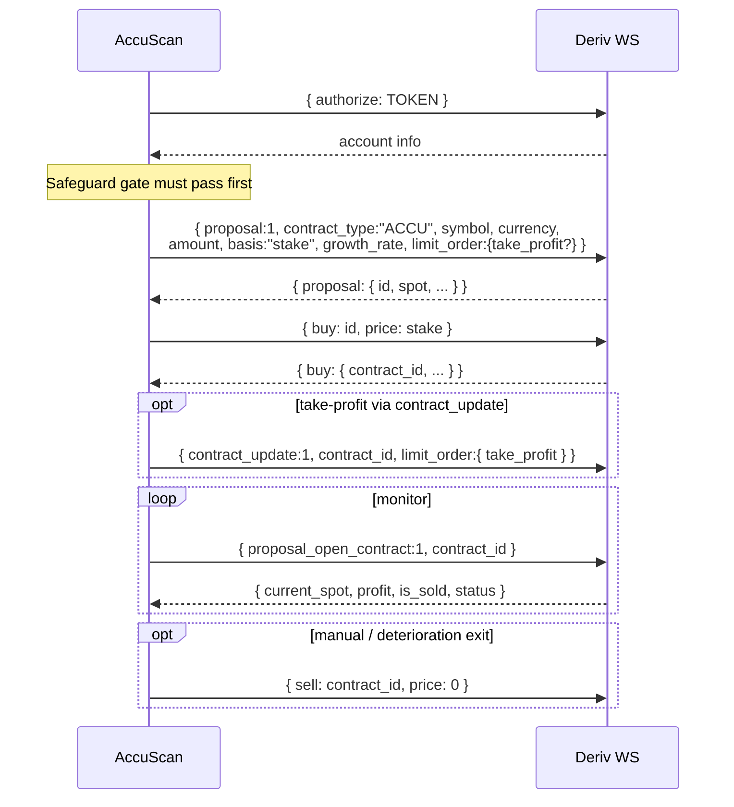

# Deriv API Flow

This describes how AccuScan talks to Deriv. The transport layer (`accuscan/transport`) is the only
place that performs network I/O; everything else depends on the abstract `MarketDataSource` /
`ExecutionGateway` interfaces, so an offline mock or a legacy/v3-style client can be dropped in
behind the same interface (compatibility-safe).

> Endpoint names and ACCU parameters are anchored to Deriv official docs (new:
> developers.deriv.com, legacy: legacy-docs.deriv.com). Details paraphrased for licensing
> compliance — verify against the live docs.

## 1. Connection

```
wss://ws.derivws.com/websockets/v3?app_id=<APP_ID>
```

- One multiplexed connection; requests carry an incrementing `req_id` and responses are correlated
  back to their futures. Streaming `tick` messages are routed by `subscription.id`.
- The **public market-data path needs no token**. `authorize` is called only for demo/live.

## 2. Discovery & seeding (public)

```mermaid
sequenceDiagram
  participant C as AccuScan
  participant D as Deriv WS
  C->>D: { active_symbols: "brief", product_type: "basic" }
  D-->>C: list of symbols (+ pip)
  loop per symbol (bounded concurrency)
    C->>D: { contracts_for: SYMBOL, currency }
    D-->>C: available contracts
    Note over C: keep symbol iff ACCU present;<br/>capture allowed growth rates
  end
  loop per eligible symbol
    C->>D: { ticks_history: SYMBOL, count: N, end: "latest", style: "ticks" }
    D-->>C: history (prices, times) -> seed rolling windows
    C->>D: { ticks: SYMBOL, subscribe: 1 }
    D-->>C: stream of tick updates
  end
  C->>D: { ping: 1 }  (periodic latency / health check)
```

Compatibility note: legacy `ticks_history` restricts `granularity` to a fixed set; AccuScan only
uses `style: "ticks"` (no granularity), which behaves the same on new and legacy APIs.
`contracts_for` field naming has varied across versions, so ACCU growth rates are extracted
defensively from several possible keys.

## 3. Execution (demo / live only)



### Dual-path take-profit (compatibility)

Accumulators support take-profit through `limit_order` (there is **no stop-loss**). AccuScan
supports three modes via `execution.take_profit_mode`:

| Mode | Behaviour |
|---|---|
| `proposal` | set `limit_order.take_profit` at proposal time (default) |
| `contract_update` | buy first, then set take-profit via `contract_update` |
| `both` | proposal-time TP, then reaffirm via `contract_update` |

If `contract_update` is unsupported for a contract, the proposal-time TP still applies; the failure
is logged and execution continues.

## 4. Health utilities

- `ping` round-trip is measured with a monotonic clock and fed into the data-quality score; high
  latency contributes to deterioration and can trigger a `latency` alert.
- Feed staleness (no tick for `staleness_warn_ms`) and tick gaps degrade data quality and can veto
  entries via the `data_quality` veto.

## 5. Safety invariants enforced around the API

- The scanner/analytics path is only ever handed a `MarketDataSource`; it has **no** way to place an
  order. An `ExecutionGateway` is constructed only for demo/live modes.
- `validate_execution_allowed()` refuses to start demo/live without a token, and live without the
  explicit confirmation token.
- The trader exposes **no** method that increases stake after a loss (no martingale by construction).
