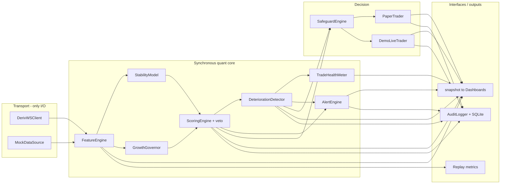

# Architecture

AccuScan is a set of small, single-responsibility modules wired together by a synchronous per-tick
core (`scanner.MarketScanner.process_tick`) that is reused unchanged by both the live async loop and
the offline replay engine. This guarantees that what you backtest is exactly what runs live.

## Layers

## Why the core is synchronous

- **Determinism & testability:** `process_tick(tick, now)` is pure w.r.t. external state, so replay
  feeding historical ticks produces identical decisions to live.
- **Reuse:** the async `Application.run` loop simply calls `process_tick` for each streamed tick and
  republishes `scanner.snapshot()` on an interval; the replay engine calls the same method.

## Threading / concurrency model

- **Live:** a single asyncio loop owns the WS connection (reader task + request futures) and the
  per-tick processing. The HTTP dashboard runs a `ThreadingHTTPServer` in a daemon thread and only
  *reads* the latest snapshot (a plain dict), so there is no shared-state mutation across threads on
  the hot path.
- **Offline:** no network; the mock source yields ticks on the same loop.

## State ownership

| State | Owner | Lifecycle |
|---|---|---|
| Rolling tick windows | `FeatureEngine` per-symbol `SymbolBuffer` (deque, max=1000) | bounded |
| Readiness persistence | `ScoringEngine` | reset when status leaves READY |
| Entry baseline + CUSUM/EWMA | `DeteriorationDetector` per symbol | set when actionable/in-trade; CUSUM capped for fast recovery |
| Trade / safeguard counters | `SafeguardEngine` | daily roll-over, hourly window |
| Positions | `PaperTrader` / `DemoLiveTrader` | open→close |
| Audit | `AuditLogger` (+ optional `Storage`) | append-only |

## Configuration resolution

`config/default.yaml` → `config/risk_profiles.yaml` → environment / `.env` → explicit CLI args.
Secrets (API token) come **only** from the environment. The loader falls back to a built-in
YAML parser (`yaml_lite`) when PyYAML is absent, keeping the system dependency-free.

## Extensibility hooks (optional modules)

The design leaves clean seams for the optional upgrades described in the brief:

- **Volatility-clustering forecast (GARCH/HAR/EWMA):** `StabilityModel` already consumes movement
  features; a forecast term can be blended into `barrier_risk`/`jump_burst_prob`.
- **Jump-robust realized variance / bipower variation:** add as a movement feature and reference in
  `tail_risk`.
- **Periodicity / time-slot learner:** a sidecar that adjusts thresholds by time-of-day, fed into
  the scoring `risk_fit` term.
- **ML anomaly sidecar (veto-only):** install `[ml]` extra; expose a function returning a veto flag
  consumed by `ScoringEngine` (never as positive alpha).
- **Permissiveness veto:** if too many independent symbols fire READY simultaneously, damp
  actionability (a cross-symbol check in the scanner snapshot step).

Each hook is intentionally a *veto / risk-reducing* input, consistent with the safety-first design.

## Failure handling

- WS request timeouts raise `DerivWSError`; the scanner continues on other symbols and logs the
  rejection. Misbehaving alert sinks are isolated (never break the pipeline). Feed staleness and
  latency degrade data quality and can veto entries rather than trading blind.
